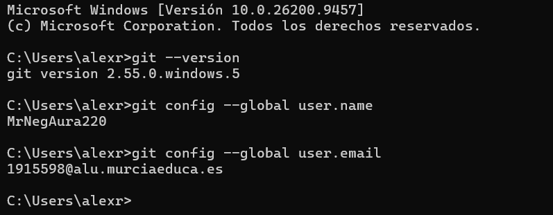
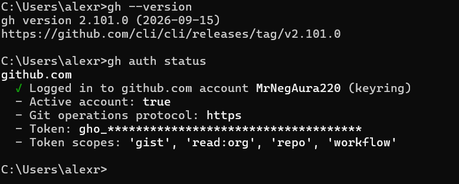
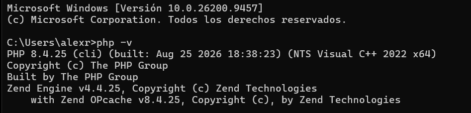
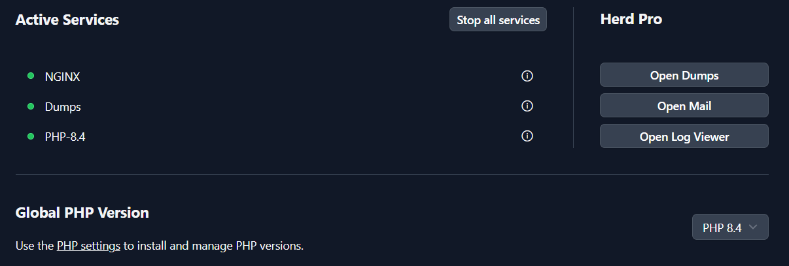
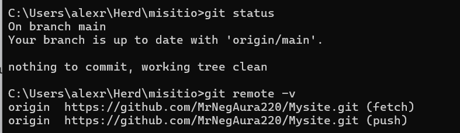
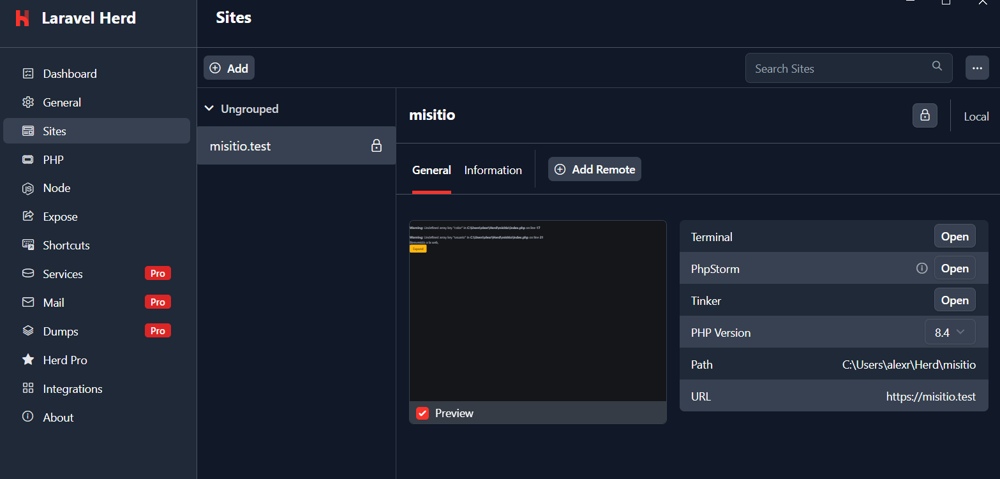

# Practica01: instalación y configuración del sitio web en local

**Autor:** MrNegAura · 2º DAW · Diseño de Interfaces Web

## Introducción

En este proyecto he montado en mi ordenador el entorno para trabajar con mi sitio web **misitio** en local y he documentado todo el proceso con **ProperDocs**. He usado Git y GitHub CLI para el control de versiones, y Laravel Herd para servir la web con PHP 8.4 y HTTPS.

## 1. Git instalado y configurado

Lo primero fue instalar Git en Windows. Para comprobar que estaba bien instalado usé `git --version`, y luego configuré mi usuario y mi correo del instituto para que los *commits* salgan a mi nombre:

```bash
git --version
git config --global user.name "MrNegAura220"
git config --global user.email "*******@alu.murciaeduca.es"
```

Con `git config --global user.name` y `git config --global user.email` comprobé que se habían guardado.



## 2. GitHub CLI instalado y configurado

Después instalé **GitHub CLI** (`gh`) para poder trabajar con GitHub desde la terminal. Inicié sesión con `gh auth login` y verifiqué que todo iba bien con `gh auth status`: aparece mi cuenta conectada, el protocolo `https` y los permisos del token (`gist`, `read:org`, `repo` y `workflow`).

```bash
gh --version
gh auth login
gh auth status
```



## 3. Herd instalado con PHP 8.4

Instalé **Laravel Herd**, que ya trae NGINX y PHP para desarrollar en local sin configurar nada a mano. En la instalación dejé **PHP 8.4** como versión global. Lo comprobé desde la terminal con `php -v` (me sale la 8.4.25) y en el panel de Herd, donde los servicios NGINX, Dumps y PHP-8.4 aparecen activos.

```bash
php -v
```





## 4. Repositorio "misitio" clonado en local

Cloné el repositorio de GitHub dentro de la carpeta de Herd (`C:\Users\alexr\Herd`) con el nombre `misitio`, para que Herd lo detecte automáticamente:

```bash
cd C:\Users\alexr\Herd
git clone https://github.com/MrNegAura220/Mysite.git misitio
```

Con `git status` veo que estoy en la rama `main`, actualizada con `origin/main` y sin cambios pendientes. Con `git remote -v` compruebo que el remoto `origin` apunta a mi repositorio de GitHub.

```bash
git status
git remote -v
```



## 5. Herd enlazado a "misitio" y sirviéndolo en HTTPS

En la pestaña **Sites** de Herd aparece `misitio.test`, que apunta a la carpeta `C:\Users\alexr\Herd\misitio` y usa PHP 8.4. Activé el candado (**Secure**) para que el sitio funcione con certificado y se abra por HTTPS en `https://misitio.test`.



## Resumen de elementos y plugins de ReadTheDocs usados

Para esta documentación he usado el tema **readthedocs** que viene incluido en ProperDocs. Estos son los elementos que he configurado en `properdocs.yml`:

| Elemento | Para qué lo uso |
|----------|-----------------|
| Tema `readthedocs` | Da el aspecto de la web: menú lateral con las secciones y diseño limpio para documentación. |
| `nav` | Define el menú lateral y el orden de las páginas (Inicio, Proyectos, Archivos explicativos, Guía de uso). |
| Plugin `search` | Añade el buscador de la web para encontrar contenido rápido. |
| Extensión `admonition` | Permite crear recuadros de aviso o nota (`!!! info`, `!!! note`). |
| Extensión `tables` | Permite hacer tablas en Markdown, como esta. |
| Extensión `toc` | Genera el índice de cada página y los enlaces en los títulos (`permalink`). |
| Extensión `fenced_code` | Permite poner bloques de código con tres comillas invertidas. |

Además, todas las páginas están escritas en **Markdown**, y las imágenes están en una única carpeta `img`.
